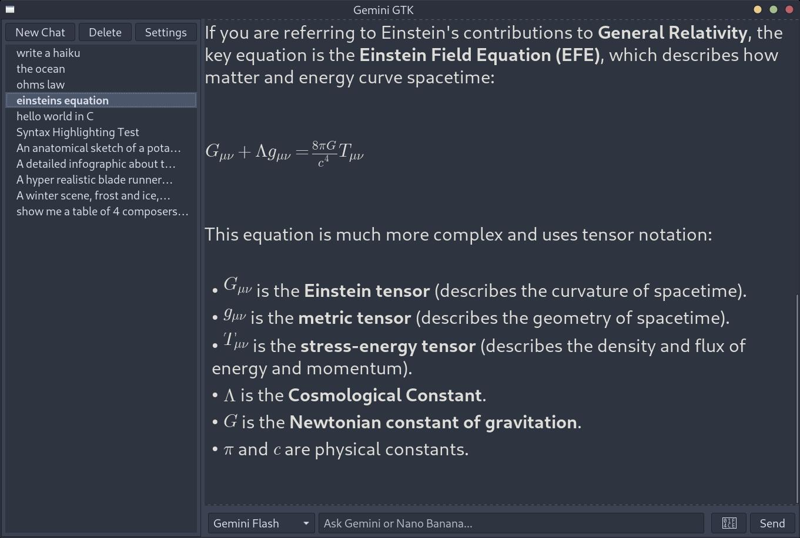
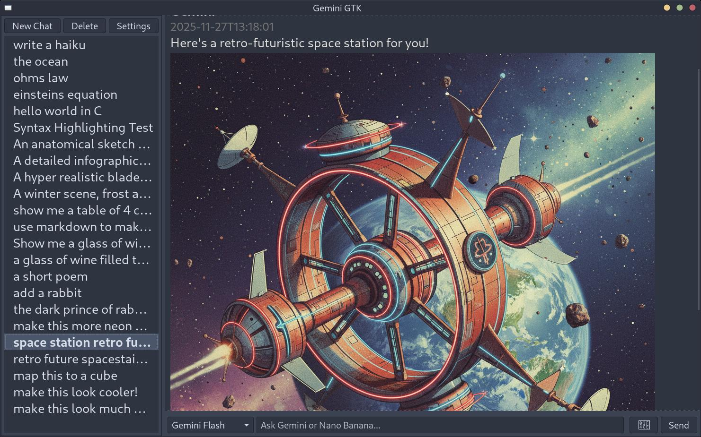

# GeminiGTK

Native GTK+ 3 desktop client for exploring Gemini and Nano Banana models.

## Features

- Conversation sidebar with create/delete controls and persistent history stored on disk (`~/.gemini_gtk/conversations.json`).
- Main chat view that formats role, timestamp, and message content for readability.
- Bottom input bar with model selector, text entry, and send button.
- Real-time calls to Gemini / Nano Banana models via the official `google-genai` SDK with graceful error feedback.
- Lightweight Markdown-style rendering for model responses (headings, bold/italic, lists, code fences, and horizontal rules), plus LaTeX math rendering to inline images when `matplotlib` is available.

## Running locally

1. Install the runtime dependencies (Ubuntu/Debian example):

   ```bash
   sudo apt-get update && sudo apt-get install -y python3-gi gir1.2-gtk-3.0 python3-gi-cairo
   ```

2. Install the Gemini SDK:

   ```bash
   pip install google-genai
   ```

3. Export your API key (either `GEMINI_API_KEY` or `GOOGLE_GENAI_API_KEY` is accepted):

   ```bash
   export GEMINI_API_KEY="your-key-here"
   ```

4. Launch the application:

   ```bash
   python3 src/main.py
   ```

The first run will create the `~/.gemini_gtk` directory for storing conversations.

## Screenshots

*Syntax highlighting*


*Support for Equations*


*Image Generation*

